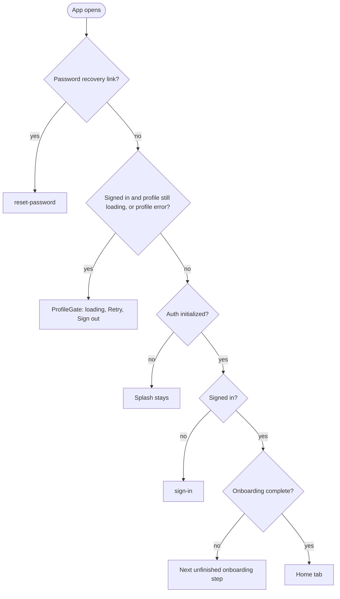
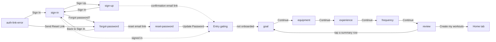
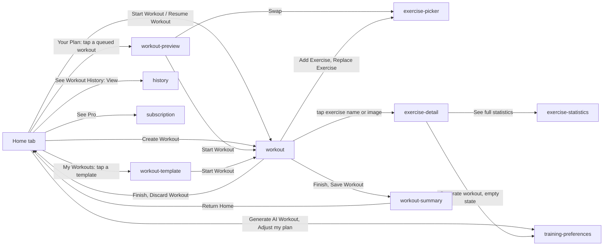
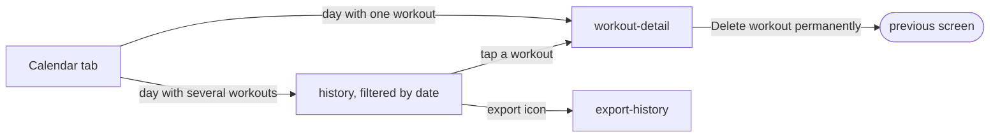
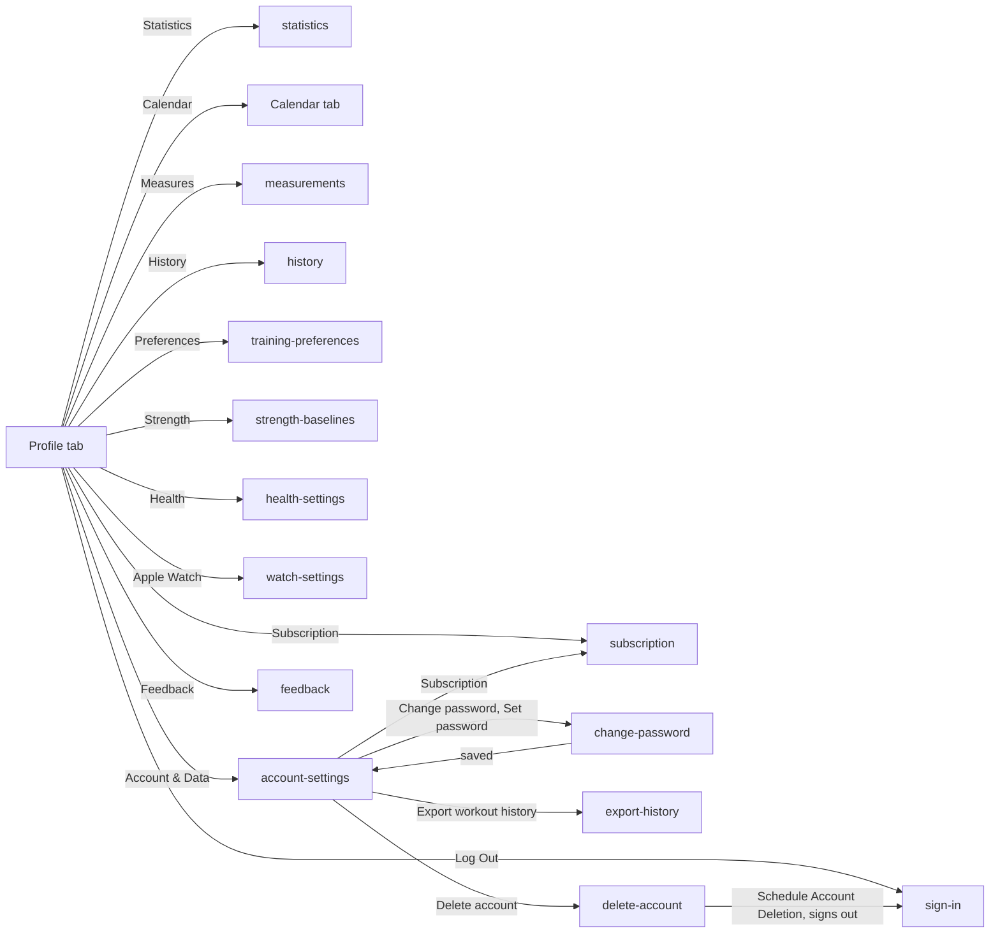

# Mobile App Navigation Map

> **Document status:** Current reference
> **Purpose:** Show which screens the mobile app has and how a user moves between them, so new contributors can find their way around the app.
> **Last reviewed:** 2026-09-25

## Table Of Contents

- [Scope](#scope)
- [Where A User Lands](#where-a-user-lands)
- [Sign-In And Onboarding](#sign-in-and-onboarding)
- [Home And The Workout Loop](#home-and-the-workout-loop)
- [Calendar And History](#calendar-and-history)
- [Profile, Tracking And Settings](#profile-tracking-and-settings)
- [Ways Into The App From Outside](#ways-into-the-app-from-outside)
- [How Screens Are Presented](#how-screens-are-presented)
- [Screen Directory](#screen-directory)
- [Dev-Only, Legacy And Unused Code](#dev-only-legacy-and-unused-code)
- [Known Gaps](#known-gaps)

## Scope

The mobile app uses Expo Router, so every file in
[`apps/mobile/app`](../apps/mobile/app) is a route. The tab bar has three
tabs: Home, Calendar and Profile. Everything else is a root stack screen
opened on top of the tabs.

This map was derived from the code on `main` at `c3aac73`. Diagrams go stale
when navigation changes: the route files and the `router.*` calls they cite
are the source of truth. Update this document in the same change as any new
route or navigation edge.

Arrow labels are the button or row text the user taps. Dashed arrows are
automatic redirects rather than taps.

## Where A User Lands

[`app/index.tsx`](../apps/mobile/app/index.tsx) checks these conditions in
order. The group layouts in `(auth)`, `(onboarding)` and `(tabs)` repeat the
same guards, so a state change anywhere (for example signing out) redirects
the user without explicit navigation.

`ProfileGate` ([`components/auth/profile-gate.tsx`](../apps/mobile/components/auth/profile-gate.tsx))
is a placeholder, not a route. Root stack screens opened while signed out are
sent back to sign-in by
[`hooks/use-deep-link-auth-guard.ts`](../apps/mobile/hooks/use-deep-link-auth-guard.ts).

## Sign-In And Onboarding

- Every onboarding step has a Back link to the previous step.
- From review, tapping Goal, Equipment, Experience or Schedule opens that step
  in edit mode. Its button then reads "Save changes" and returns to review.
- Sign-up goes straight to onboarding only when the response already contains
  a session. Otherwise the user confirms by email first.

## Home And The Workout Loop

This is the core training loop from [`PROJECT.md`](../PROJECT.md): pick or
start a workout, log it, finish it, and let the result shape the next one.

- "Start Workout" on Home appears on the next-up card in Your Plan. The streak
  card's "Start a workout" does the same, or opens training preferences when
  no workout is queued.
- "Generate AI Workout" opens training preferences only when the profile is
  missing split, duration, equipment, style or difficulty. The queue can also
  push training preferences on its own when it first builds without them.
- The X in the workout top bar minimizes the workout. It stays active, and
  Home offers "Resume Workout".
- The exercise picker returns to the screen that opened it. Its mode (`add`,
  replace or `pending_swap`) decides what the choice changes.
- The paywall on Home is an in-screen modal, not a route.

## Calendar And History

Days without a workout can't be tapped.

## Profile, Tracking And Settings

Profile rows are defined in one table in
[`app/(tabs)/profile.tsx`](<../apps/mobile/app/(tabs)/profile.tsx>).

- Statistics, measurements, strength baselines, health settings, watch
  settings, export history and subscription have only a back button.
- Saving training preferences returns to the previous screen and rebuilds the
  workout queue.
- Pro users see a confirmation alert before delete-account opens.
- The sync failure banner is global. Its "Contact support" action opens
  feedback from any screen, with a diagnostic reference.

## Ways Into The App From Outside

The URL scheme is `sweaty` ([`app.json`](../apps/mobile/app.json)). There
are no universal links or Android intent filters, so each `sweaty://<route>`
link maps directly to a route. Signed-out users are sent to sign-in.

| Source                                   | Opens                                                      | Where it is defined                                                                                           |
| ---------------------------------------- | ---------------------------------------------------------- | ------------------------------------------------------------------------------------------------------------- |
| Sign-up confirmation email (`sweaty://`) | Entry gating                                               | [`hooks/use-deep-links.ts`](../apps/mobile/hooks/use-deep-links.ts)                                           |
| Password reset email                     | reset-password                                             | [`hooks/use-deep-links.ts`](../apps/mobile/hooks/use-deep-links.ts)                                           |
| Expired or broken email link             | auth-link-error                                            | [`hooks/use-deep-links.ts`](../apps/mobile/hooks/use-deep-links.ts)                                           |
| Live Activity or Dynamic Island tap      | workout                                                    | [`targets/widget/SweatyLiveActivity.swift`](../apps/mobile/targets/widget/SweatyLiveActivity.swift)           |
| Live Activity "Mark set done"            | workout, and marks the set                                 | [`targets/widget/MarkSetDoneIntent.swift`](../apps/mobile/targets/widget/MarkSetDoneIntent.swift)             |
| Live Activity skip or adjust rest        | Nothing; runs in the background                            | [`targets/widget/RestTimerIntents.swift`](../apps/mobile/targets/widget/RestTimerIntents.swift)               |
| Next workout widget                      | workout when one is in progress, otherwise workout-preview | [`lib/home-widgets/build-snapshot.ts`](../apps/mobile/lib/home-widgets/build-snapshot.ts)                     |
| Consistency widget                       | history                                                    | [`targets/widget/Home/ConsistencyWidget.swift`](../apps/mobile/targets/widget/Home/ConsistencyWidget.swift)   |
| Training time widget                     | statistics                                                 | [`targets/widget/Home/TrainingTimeWidget.swift`](../apps/mobile/targets/widget/Home/TrainingTimeWidget.swift) |
| Streak week widget                       | No link, on purpose                                        | [`targets/widget/Home/StreakWeekWidget.swift`](../apps/mobile/targets/widget/Home/StreakWeekWidget.swift)     |
| Apple Watch "finish workout"             | workout-summary, from whatever screen is open              | [`hooks/use-watch-bridge.ts`](../apps/mobile/hooks/use-watch-bridge.ts)                                       |
| Rest timer notification                  | No route; the app opens where it was                       | [`lib/rest-timer-notifications.ts`](../apps/mobile/lib/rest-timer-notifications.ts)                           |

The app has no push notifications. Widgets without data have no link.

## How Screens Are Presented

The presentation for each route is set in
[`app/_layout.tsx`](../apps/mobile/app/_layout.tsx). No screen uses the native
stack header; screens draw their own header with a back button.

| Presentation          | Routes                                                                                                                                                          |
| --------------------- | --------------------------------------------------------------------------------------------------------------------------------------------------------------- |
| Full-screen modal     | workout and workout-summary (swipe to dismiss is off), exercise-picker, exercise-detail, exercise-statistics, workout-preview, generate-workout (redirect only) |
| Modal                 | design-system, modal                                                                                                                                            |
| Pushed card with back | every other root screen                                                                                                                                         |

Delete-account also blocks going back while a deletion request is running.

## Screen Directory

| Area       | Route                     | What the user does there                                                                  |
| ---------- | ------------------------- | ----------------------------------------------------------------------------------------- |
| Auth       | `(auth)/sign-in`          | Sign in with email and password, Apple or Google.                                         |
| Auth       | `(auth)/sign-up`          | Create an account, then see the "check your email" state.                                 |
| Auth       | `(auth)/forgot-password`  | Request a password reset link.                                                            |
| Auth       | `(auth)/reset-password`   | Set a new password after opening the recovery link.                                       |
| Auth       | `auth-link-error`         | Recover from a failed email link.                                                         |
| Onboarding | `(onboarding)/goal`       | Pick a training goal or type a custom one.                                                |
| Onboarding | `(onboarding)/equipment`  | Choose available equipment.                                                               |
| Onboarding | `(onboarding)/experience` | Set the experience level.                                                                 |
| Onboarding | `(onboarding)/frequency`  | Set days per week and session length.                                                     |
| Onboarding | `(onboarding)/review`     | Check and edit answers, set style and constraints, then create the first workouts.        |
| Tabs       | `(tabs)/index`            | Home: weekly progress, streak, the AI workout queue, saved templates, history link.       |
| Tabs       | `(tabs)/calendar`         | Month view of past workouts.                                                              |
| Tabs       | `(tabs)/profile`          | Stats summary, language switch, links to tracking and settings, log out.                  |
| Workouts   | `workout`                 | Log the active workout: sets, rest, add, replace or reorder exercises, finish or discard. |
| Workouts   | `workout-summary`         | Post-workout stats, difficulty feedback, share, save as template.                         |
| Workouts   | `workout-preview`         | Review, edit, swap or regenerate a queued AI workout, then start it.                      |
| Workouts   | `workout-template`        | Review a saved template and start it.                                                     |
| Workouts   | `workout-detail`          | View, edit or delete a completed workout.                                                 |
| Workouts   | `history`                 | Paged list of past workouts, or one day's workouts.                                       |
| Workouts   | `export-history`          | Export workout history as a file and share it.                                            |
| Exercises  | `exercise-picker`         | Search and filter exercises to add, replace or swap.                                      |
| Exercises  | `exercise-detail`         | Exercise info, history, charts and preference.                                            |
| Exercises  | `exercise-statistics`     | The same screen in full-statistics mode.                                                  |
| Tracking   | `statistics`              | Activity heatmap, muscle split, volume over time, personal records.                       |
| Tracking   | `measurements`            | Log and track body measurements.                                                          |
| Settings   | `strength-baselines`      | Enter working weights and reps for baseline exercises.                                    |
| Settings   | `training-preferences`    | Split, duration, equipment, style, difficulty and units.                                  |
| Settings   | `health-settings`         | Apple Health or Health Connect sync status and permissions.                               |
| Settings   | `watch-settings`          | Apple Watch connection status and watch preferences.                                      |
| Account    | `subscription`            | Plan and usage, upgrade (coming soon), manage the store subscription.                     |
| Account    | `account-settings`        | Password, subscription, export and account deletion.                                      |
| Account    | `change-password`         | Set or change the password, with re-authentication.                                       |
| Account    | `delete-account`          | Schedule account deletion with a typed confirmation; signs the user out.                  |
| Account    | `feedback`                | Send a bug report or feature request.                                                     |

## Dev-Only, Legacy And Unused Code

- `design-system` is a UI component gallery. Nothing in the app links to it.
- `modal` is an Expo template leftover. Nothing links to it.
- `generate-workout`, `(onboarding)/gender` and `(onboarding)/strength` only
  redirect. They keep old links working.
- `components/workout/mini-workout-bar.tsx`, `hooks/use-generate-workout.ts`
  and `components/external-link.tsx` are not used by any screen.

## Known Gaps

These behaviors could not be confirmed from the code alone:

- "Return Home" on workout-summary dismisses two screens. Starting from Home,
  that lands on the tabs. Starting from workout-preview, it probably lands back
  on workout-preview. After an Apple Watch finish, it depends on the screen
  that was open. Tracked in
  [SWE-198](https://linear.app/sweaty/issue/SWE-198).
- A signed-in user who hasn't finished onboarding can open root screens through
  a widget or deep link, because the root-screen guard checks only sign-in.
  Tracked in [SWE-199](https://linear.app/sweaty/issue/SWE-199).
- After saving, change-password replaces itself with account-settings while
  account-settings is already underneath, which may leave it twice in the
  stack. Tracked in [SWE-200](https://linear.app/sweaty/issue/SWE-200).
